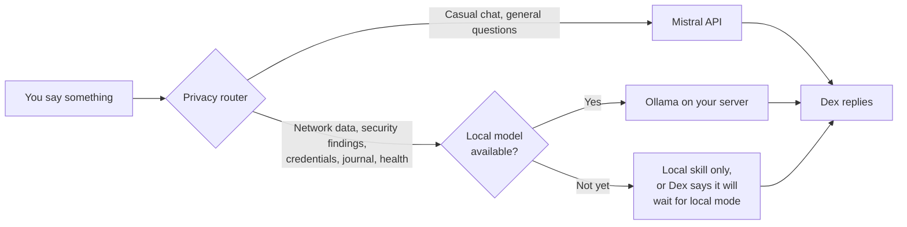

<p align="center">
  
</p>

<p align="center">
  <a href="LICENSE"></a>
  
  
  
  
</p>

<p align="center">
  <a href="#what-is-dex">About</a> |
  <a href="#privacy-and-security">Privacy &amp; security</a> |
  <a href="#how-it-works">How it works</a> |
  <a href="#setup-wizard-and-companion-app">Setup wizard</a> |
  <a href="#choosing-a-brain">Choosing a brain</a>
</p>

> [!NOTE]
> Dex is in early development. Most of what's described below is the direction the project is headed, not something that works yet.

## What is Dex

Dex is an open-source desk robot: a friend who remembers your day, a life assistant, and a security sidekick for your home network.

Built on [Stack-chan](https://github.com/stack-chan/stack-chan), and also available as a phone app — same brain, memory and skills either way. Everything runs on a small home server you own. Default LLM is Mistral, an EU provider; switch to a fully local model with one config change.

## Privacy and security

Dex has a microphone, remembers your conversations and can run tools — every design choice starts from what that requires.

<p align="center">
  
</p>

- The robot never talks to an AI provider directly and never stores API keys or identity — lose the robot, lose nothing.
- Every request is classified before it leaves Dex core; security findings, credentials, journal and health data never go to a cloud model.
- Default LLM is Mistral, headquartered in the EU. Go fully local at any time with one config change.



Sensitive categories are defined in `dex.yaml` and can only be made stricter from the web app, never looser, without re-authenticating.

> [!WARNING]
> Do not expose the Dex server to the internet by forwarding its ports on your router — that puts a microphone, your personal memory and your home network data within reach of anyone who finds the open port. Use [Tailscale](https://tailscale.com/) for remote access instead.

| Risk | Mitigation |
| :-- | :-- |
| API key extracted from the robot | Keys live only on the server in `.env`. The robot holds no secrets beyond Wi-Fi. |
| Secrets committed to Git | `dex.yaml` and `.env` are gitignored; `dex.example.yaml` is committed instead. Pre-commit hook plus CI secret scanning catch mistakes. |
| Insecure defaults left unchanged | Shipped config defaults to strictest privacy, read-only skills, no machine control. No default passwords — credentials are generated on first boot and shown once. |
| Robot used as a pivot into the home network | Robot sits on its own VLAN and can only reach the voice gateway port. |
| Server exposed to the internet | No port forwarding. Remote access only through Tailscale or WireGuard. |
| Prompt injection from web pages, feeds or emails | Tools are allowlisted and read-only by default. State-changing actions need a physical head-touch. |
| Sensitive data sent to a cloud model | Privacy router enforces local-only categories. Zero-cloud mode available once running fully local. |
| Always-on microphone | Wake word gating, a visible LED while streaming, and a mute option. |
| Unauthorized network scanning | Network skills only run against subnets listed in `dex.yaml` that you own. |
| LLM given command execution | Allowlisted commands only, no raw shell, a disposable VM, physical confirmation per command, local model only. |
| Multi-user data leakage | Per-user memory isolation; authentication required before any account beyond the owner can be created. |
| Automatic firmware OTA from vendor | Vendor update checks disabled in custom firmware; updates come only from the self-hosted OTA URL. |

Found a vulnerability? Report it privately via [SECURITY.md](SECURITY.md), not a public issue.

## Features

| Friend | Life assistant | Security sidekick |
| :-- | :-- | :-- |
| Consistent personality, voice and expressive face | Reminders, timers and a morning briefing | Alerts when an unknown device joins your Wi-Fi |
| Remembers past conversations (stored on your SSD) | Calendar and weather at a glance | Daily digest of actively exploited CVEs that affect your software |
| Reacts with head movements, LEDs and moods | Searches your own notes and documents | Summaries of Pi-hole, Suricata or Wazuh alerts |
| Wake word, so it only listens when called | Home and PC control through the server | Certificate expiry checks for your services |
| Physical head-touch to confirm actions | Works offline for local skills | Study buddy for certs and CTF practice |

## How it works

<p align="center">
  
</p>

Thin robot, smart server. The robot never talks to an AI provider directly.

- **Dex robot.** Stack-chan on an M5Stack CoreS3 — streams audio, plays speech, renders face and head movement.
- **Voice gateway.** Self-hosted [xiaozhi-esp32-server](https://github.com/xinnan-tech/xiaozhi-esp32-server) — wake word, local speech-to-text and text-to-speech.
- **Dex core.** Holds Dex's personality, memory lookups, tool routing and the privacy router.
- **Memory.** SQLite conversation log plus a vector index built with a local embedding model.
- **Skills.** Small, allowlisted tools for life and security tasks — no raw shell.
- **Web app.** Setup wizard and dashboard, served by your own server.
- **LLM backend.** Any OpenAI-compatible endpoint — Mistral by default, swappable to Ollama or others.

Identity and memory live only on the server, never in firmware. Lose the robot, lose nothing — a new body reconnects to the same Dex.

## Hardware

| Part | What it does | Estimated price | Notes |
| :-- | :-- | :-- | :-- |
| M5Stack StackChan kit (K151) | CoreS3 robot body with servos, camera, mic, speaker, 12 RGB LEDs and touch panel | €120-130 | The complete kit; nothing else needed for the robot |
| Home server | Runs the voice gateway, Dex core and memory | €0-150 | Free if you already have a Linux box, NAS or Proxmox host; a used mini PC with 16 GB RAM covers it otherwise |
| Storage | Memory, vector index, logs | €0-25 | 64 GB minimum, 100 to 200 GB comfortable |

> [!NOTE]
> Prices are rough estimates in EUR (September 2026) and vary by region and retailer — check before buying. A realistic minimum if you already own a server is the kit alone. Works well on a virtualization host: an LXC container with 2 cores, 4 GB RAM and 32 GB disk is enough for one user.

> [!NOTE]
> The robot always needs a network path back to your server. For remote access, [Tailscale](https://tailscale.com/) is recommended — no public IP needed, works behind CGNAT. Plain WireGuard also works but needs a public IP or a small VPS relay. The phone app connects to either directly and is the recommended body for Dex on the go; taking the robot itself off-site needs a travel router (for example GL.iNet) to hold the tunnel.

## Software stack

| Layer | Choice | Why |
| :-- | :-- | :-- |
| Robot firmware | [Stack-chan](https://github.com/stack-chan/stack-chan) / [m5stack/StackChan](https://github.com/m5stack/StackChan) | Open source, active community, Xiaozhi protocol support |
| Voice gateway | [xiaozhi-esp32-server](https://github.com/xinnan-tech/xiaozhi-esp32-server) | Self-hostable, works with any OpenAI-compatible LLM |
| Speech-to-text | [whisper.cpp](https://github.com/ggml-org/whisper.cpp) or SenseVoice | Runs on CPU, stays local |
| Text-to-speech | [Piper](https://github.com/rhasspy/piper) | Lightweight, local, many voices |
| LLM today | [Mistral API](https://docs.mistral.ai/) | Free Experiment tier, OpenAI-compatible, EU-based |
| LLM later | [Ollama](https://ollama.com/) | Same API shape, fully local |
| Dex core | Python, FastAPI, SQLite | Simple to read, easy to extend |
| Web app | PWA (TypeScript) | One codebase for Samsung, iPhone and desktop |

## Setup wizard and companion app

First-run configuration, not account creation — runs once, after you clone the repository and start the server. Six steps: detect the server and generate certificates, paste your own LLM API key, choose a brain, set privacy defaults, pair the robot, personalize Dex. Ends with a plain-language privacy summary.

- Dex's own app replaces M5Stack's StackChan World app: no vendor account, no default cloud service, no reported Android login issues.
- Ships as a PWA: installs from the browser on Samsung, other Android and iPhone, no app store, same server as Dex core.

## Configuration

Dex core reads a single `dex.yaml`. A trimmed example:

```yaml
dex:
  name: Dex
  persona: prompts/persona.md
  wake_word: "hey dex"

llm:
  default: mistral
  providers:
    mistral:
      base_url: https://api.mistral.ai/v1
      model: mistral-small-latest
      api_key_env: MISTRAL_API_KEY
    local:
      base_url: http://ollama:11434/v1
      model: ministral            # any model you have pulled
      enabled: false              # flip to true once running fully local

privacy:
  local_only:                     # never sent to a cloud provider
    - network_scan
    - security_alerts
    - credentials
    - journal
    - health
  when_local_unavailable: refuse  # or: local_skill_only

memory:
  path: /data/dex
  embeddings: local               # keeps the index portable

skills:
  confirm_with_touch:             # head-touch required before running
    - smart_home_control
    - pc_control
```

## Choosing a brain

- Any OpenAI-compatible provider works: Mistral (default, EU), DeepSeek, Claude, or a local Ollama model. Switching is one line — `llm.default` in `dex.yaml`.
- Speech-to-text and text-to-speech always run on your own server, regardless of brain — no text LLM handles audio, so your voice stays home no matter which provider you pick.
- Avoid running STT or TTS on a rented VPS: it saves little over a used mini PC and sends your audio off-site.

## Project structure

```text
dex/
├── firmware/          # Build config and patches for the Stack-chan firmware
├── installer/         # Browser-based firmware flasher
├── server/
│   ├── core/          # Dex core: persona, memory, privacy router, tools
│   ├── gateway/       # xiaozhi-esp32-server configuration
│   ├── prompts/       # Persona and system prompts
│   └── docker-compose.yml
├── skills/
│   ├── life/          # Reminders, calendar, weather, briefing
│   └── security/      # Network watch, CVE digest, cert checks
├── app/               # Companion PWA and setup wizard
└── docs/
    └── assets/        # Diagrams and graphics
```

## Acknowledgements

Dex stands on the shoulders of these projects: [Stack-chan](https://github.com/stack-chan/stack-chan) by Shinya Ishikawa and the community, [M5Stack](https://github.com/m5stack/StackChan), [xiaozhi-esp32-server](https://github.com/xinnan-tech/xiaozhi-esp32-server), [Mistral AI](https://mistral.ai/), [Ollama](https://ollama.com/), [whisper.cpp](https://github.com/ggml-org/whisper.cpp) and [Piper](https://github.com/rhasspy/piper). Thanks also to community projects like [dotty-stackchan](https://github.com/BrettKinny/dotty-stackchan), which showed that a fully self-hosted Stack-chan is possible.

Dex is an independent project and is not affiliated with M5Stack, the Stack-chan project or Mistral AI.

## License

Dex is released under the [GNU General Public License v3.0](LICENSE): free to use, study, modify and redistribute, including commercially, as long as derivative works stay open source under the same license and credit the original project. Third-party components keep their own licenses; check each upstream project before redistributing.

<p align="center">
  <sub>Built with care, curiosity and a healthy amount of paranoia.</sub>
</p>
