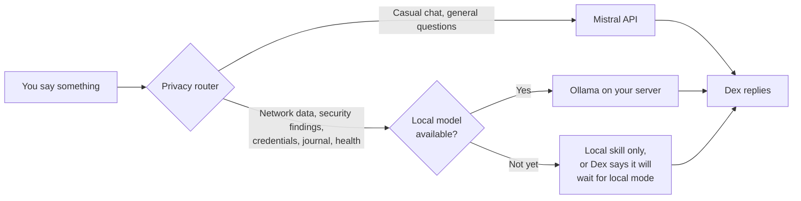

<p align="center">
  
</p>

<p align="center">
  <a href="LICENSE"></a>
  
  
  
  
</p>

<p align="center">
  <a href="#what-is-dex">About</a> |
  <a href="#how-it-works">How it works</a> |
  <a href="#roadmap">Roadmap</a> |
  <a href="#setup-wizard-and-companion-app">Setup wizard</a> |
  <a href="#choosing-a-brain">Choosing a brain</a> |
  <a href="#security-model">Security</a> |
  <a href="#contributing">Contributing</a>
</p>

> [!NOTE]
> Dex is in early development. Anything marked **planned** below describes where the project is headed, not what works today. Follow the [roadmap](#roadmap) to see progress.

## What is Dex

Dex is an open-source desk robot that tries to be three things at once: a friend who remembers your day, an assistant that keeps your life organized, and a security sidekick that keeps an eye on your home network.

It's built on [Stack-chan](https://github.com/stack-chan/stack-chan), the open-source M5Stack CoreS3 robot, and also runs as a phone app — the same brain, memory and skills, whichever body you're talking to. Each body stays simple: it listens, talks and shows a face; the robot also moves its head. Everything clever happens on a small home server you own, which means you decide where your data goes. Dex starts on Mistral's free API and is designed from day one to move to a fully local model with a single config change.

## Features

| Friend | Life assistant | Security sidekick |
| :-- | :-- | :-- |
| Consistent personality, voice and expressive face | Reminders, timers and a morning briefing | Alerts when an unknown device joins your Wi-Fi |
| Remembers past conversations (stored on your SSD) | Calendar and weather at a glance | Daily digest of actively exploited CVEs that affect your software |
| Reacts with head movements, LEDs and moods | Searches your own notes and documents | Summaries of Pi-hole, Suricata or Wazuh alerts |
| Wake word, so it only listens when called | Home and PC control through the server | Certificate expiry checks for your services |
| Physical head-touch to confirm actions | Works offline for local skills | Study buddy for certs and CTF practice |

## How it works

<p align="center">
  
</p>

Dex follows a **thin robot, smart server** design. The robot never talks to an AI provider directly and never stores API keys.

- **Dex robot.** A Stack-chan on an M5Stack CoreS3. It streams audio to the server, plays back speech, and renders the face, head movements and LEDs.
- **Voice gateway.** A self-hosted [xiaozhi-esp32-server](https://github.com/xinnan-tech/xiaozhi-esp32-server) that handles wake word, speech-to-text and text-to-speech. Speech recognition and synthesis run locally, so your voice never leaves your home.
- **Dex core.** The part this repository is really about. A Python service that holds Dex's personality, looks up memories, decides which tools may run, and routes every request through the privacy router.
- **Memory.** Conversation history in SQLite plus a vector index built with a **local** embedding model. Using a local embedder from the start means nothing needs re-indexing when Dex goes fully local.
- **Skills.** Small, allowlisted tools for life and security tasks. Dex can call them, but it never gets a raw shell.
- **Web app.** The setup wizard and dashboard, served by your own server and usable from any phone or browser.
- **LLM backend.** Any OpenAI-compatible endpoint. Today that's the Mistral API; later it's Ollama on local hardware.

### One brain, many bodies

Dex's personality, memory and skills all live on the server. The robot and the phone app are just bodies — either one can connect to the same brain, and neither is required to use the other. This is a hard rule for the project: **never store identity or memory in firmware.** If a robot is lost, stolen or bricked, nothing about you leaves with it, and a new body picks up the exact same Dex the moment it connects to your server.

### The privacy router

Mistral's free tier may use API requests to improve its models, so Dex never sends it anything sensitive. Every request is classified before it leaves Dex core:



Sensitive categories are defined in `dex.yaml` and can only be made stricter from the web app, never looser, without re-authenticating.

## Roadmap

<p align="center">
  
</p>

<details open>
<summary><b>Phase 0: Foundation</b></summary>

- [ ] Flash and test the Stack-chan firmware on the CoreS3
- [ ] Set up a Linux home server with Docker
- [ ] Put the robot on an isolated IoT VLAN that can only reach the voice gateway
- [ ] Create the repository structure, license and security policy
</details>

<details>
<summary><b>Phase 1: Server and voice</b></summary>

- [ ] Run xiaozhi-esp32-server locally and point the robot at a self-hosted OTA URL, never the vendor's
- [ ] Local speech-to-text with Whisper
- [ ] Local text-to-speech with Piper
- [ ] Confirm audio round-trips entirely inside the home network
</details>

<details>
<summary><b>Phase 2: Brain and API</b></summary>

- [ ] Dex core exposes an OpenAI-compatible endpoint that the voice gateway talks to
- [ ] First version of Dex's persona prompt and mood-to-face mapping
- [ ] Privacy router sits in front of every LLM call
- [ ] Mistral wired in behind the router, provider swappable with one line in `dex.yaml`
</details>

<details>
<summary><b>Phase 3: Memory and tasks</b></summary>

- [ ] Conversation log in SQLite
- [ ] Local embeddings (for example `nomic-embed-text`) and a vector index on the SSD
- [ ] Reminders and to-dos, stored in SQLite
- [ ] CSV import and export for reminders and to-dos (CSV is a transfer format only, never the store)
</details>

<details>
<summary><b>Phase 4: Skills</b></summary>

- [ ] Life: reminders, timers, calendar, weather, morning briefing
- [ ] Security: new-device alerts, CVE digest from the CISA KEV catalog, certificate checks
- [ ] Tool allowlist with read-only defaults
- [ ] Head-touch confirmation for any action that changes something
</details>

<details>
<summary><b>Phase 5: App and second body</b></summary>

- [ ] PWA with Dex's face, microphone input and a WebSocket connection to Dex core
- [ ] Same brain, same memory, whichever body you're talking to
- [ ] WireGuard or Tailscale for remote access to the home server
- [ ] Single-user only; accounts come in the next phase
</details>

<details>
<summary><b>Phase 6: Hardening and shared use</b></summary>

Dex is distributed on GitHub, so each user runs and owns their own server — this phase is about hardening a single install, not running a multi-tenant service.

- [ ] One owner per install by default, with authentication in front of the app and the API
- [ ] Optional extra accounts for household members
- [ ] Invite codes only; open signup is never supported
- [ ] Per-user memory isolation enforced at the database layer
- [ ] Per-user privacy settings
- [ ] Rate limiting and audit logging
</details>

<details>
<summary><b>Phase 7: Smart home</b></summary>

- [ ] Home Assistant integration using scoped tokens
- [ ] Confirmation required before any state-changing action (lights, locks, plugs)
- [ ] Read-only status queries need no confirmation
</details>

<details>
<summary><b>Phase 8: Fully local</b></summary>

- [ ] Ollama on a GPU-equipped server
- [ ] Mistral open-weight models so Dex keeps a familiar personality
- [ ] Zero-cloud mode that blocks all outbound LLM traffic
</details>

<details>
<summary><b>Phase 9: Machine control</b></summary>

- [ ] Disposable Linux VM that Dex can control, reverted between sessions
- [ ] Strict allowlist of commands; no raw shell access
- [ ] Physical confirmation required before every command runs
- [ ] Full audit log of everything the VM executed
</details>

## Hardware

| Part | Minimum | Recommended | Notes |
| :-- | :-- | :-- | :-- |
| Robot | M5Stack CoreS3 with Stack-chan body | Official M5StackChan kit | Needs a 2.4 GHz Wi-Fi network |
| Home server (phases 0 to 7) | Any 64-bit Linux box with 8 GB RAM | 16 GB RAM, quad-core CPU | A mini PC is plenty for voice and Dex core |
| Storage | 64 GB SSD | 100 to 200 GB SSD | Memory, vector index, logs and cached answers |
| Local LLM (phase 8) | GPU with 8 GB VRAM | GPU with 12 GB+ VRAM | Or a machine with large unified memory |

> [!NOTE]
> The robot always needs a network path back to your server — it has no brain of its own. For reaching your server from outside your home network, [Tailscale](https://tailscale.com/) is the recommended option: it needs no public IP and works behind CGNAT, which covers most home internet connections. Plain WireGuard works too, but needs either a public IP on your home connection or a small VPS to act as a relay.
>
> The phone app can connect over either one directly. The robot can't: an ESP32 has no VPN client to run, and Android doesn't share its VPN tunnel with hotspot clients, so tethering the robot off a phone won't reach it either. Taking the robot out of the house means carrying a small travel router (for example a GL.iNet running OpenWRT) that holds the tunnel itself. Because of that, the phone app is the recommended body for Dex on the go.

## Software stack

| Layer | Choice | Why |
| :-- | :-- | :-- |
| Robot firmware | [Stack-chan](https://github.com/stack-chan/stack-chan) / [m5stack/StackChan](https://github.com/m5stack/StackChan) | Open source, active community, Xiaozhi protocol support |
| Voice gateway | [xiaozhi-esp32-server](https://github.com/xinnan-tech/xiaozhi-esp32-server) | Self-hostable, works with any OpenAI-compatible LLM |
| Speech-to-text | [whisper.cpp](https://github.com/ggml-org/whisper.cpp) or SenseVoice | Runs on CPU, stays local |
| Text-to-speech | [Piper](https://github.com/rhasspy/piper) | Lightweight, local, many voices |
| LLM today | [Mistral API](https://docs.mistral.ai/) | Free Experiment tier, OpenAI-compatible |
| LLM later | [Ollama](https://ollama.com/) | Same API shape, fully local |
| Dex core | Python, FastAPI, SQLite | Simple to read, easy to extend |
| Web app | PWA (TypeScript) | One codebase for Samsung, iPhone and desktop |

## Setup wizard and companion app

<p align="center">
  
</p>

The wizard is first-run configuration, not account creation. It runs once, right after you clone the repository and bring the server up, to get your own instance of Dex ready to use. The goal is that someone who has never touched a terminal can get Dex running. The planned wizard walks through six steps: detect the server and generate certificates, paste your own LLM API key, choose a brain, set privacy defaults, pair the robot, and personalize Dex. It ends with a plain-language privacy summary of what stays local and what may leave your network.

**Why not use the official app?** M5Stack's StackChan World app is available on Google Play and the App Store, but it's built around an M5Stack account and the default cloud service, which Dex replaces. Some Samsung users have also reported login problems with the Android version. Dex's app talks only to your own server.

**Why a web app first?** A progressive web app installs to the home screen on Samsung, other Android phones and iPhone, needs no app store, and ships from the same server as Dex core. Native Android and iOS builds can be wrapped from the same code later if they add real value, such as Bluetooth provisioning.

## Quick start

> [!WARNING]
> Do not expose the Dex server to the internet by forwarding its ports on your router — this is not a supported setup. It would put a microphone, your personal memory and your home network data within reach of anyone who finds the open port. Use [Tailscale](https://tailscale.com/) for remote access instead (see the [hardware](#hardware) note above).

> [!IMPORTANT]
> This is the **planned** setup flow. Commands will work once Phase 1 is complete.

```bash
# 1. Clone the repository on your home server
git clone https://github.com/YOUR-USERNAME/dex.git
cd dex/server

# 2. Create your config and add secrets (never commit this file)
cp dex.example.yaml dex.yaml
cp .env.example .env        # MISTRAL_API_KEY goes here

# 3. Start the voice gateway, Dex core and web app
docker compose up -d

# 4. Open the setup wizard from any device on your network
#    https://dex.local:8443
```

## Configuration

Dex core reads a single `dex.yaml`. A trimmed example:

```yaml
dex:
  name: Dex
  persona: prompts/persona.md
  wake_word: "hey dex"

llm:
  default: mistral
  providers:
    mistral:
      base_url: https://api.mistral.ai/v1
      model: mistral-small-latest
      api_key_env: MISTRAL_API_KEY
    local:
      base_url: http://ollama:11434/v1
      model: ministral            # any model you have pulled
      enabled: false              # flip to true in phase 8

privacy:
  local_only:                     # never sent to a cloud provider
    - network_scan
    - security_alerts
    - credentials
    - journal
    - health
  when_local_unavailable: refuse  # or: local_skill_only

memory:
  path: /data/dex
  embeddings: local               # keeps the index portable

skills:
  confirm_with_touch:             # head-touch required before running
    - smart_home_control
    - pc_control
```

## Choosing a brain

Dex core talks to the LLM through a single OpenAI-compatible interface, so any provider that speaks that API works: Mistral, DeepSeek, Claude, or a model you run yourself with Ollama. Switching is a one-line change to `llm.default` in `dex.yaml` (see [Configuration](#configuration) above) — no code changes, no re-indexing memory.

That flexibility stops at text. No text LLM can hear or speak, so speech-to-text and text-to-speech always run on your own server, whichever brain is answering. That's deliberate: it keeps your voice at home no matter which provider you pick for the "thinking" part.

For the same reason, running STT or TTS on a rented VPS isn't recommended. It sends your raw audio off-site for the sake of a modest saving over buying a used mini PC to run them at home instead.

## Security model

Dex has a microphone, knows a lot about you and can run tools, so it's treated as the most sensitive device in the house.

| Risk | Mitigation |
| :-- | :-- |
| API key extracted from the robot | Keys live only on the server in `.env`. The robot holds no secrets beyond Wi-Fi. |
| Secrets committed to Git | `dex.yaml` and `.env` are gitignored; a `dex.example.yaml` with no real values is committed instead. A pre-commit hook plus CI secret scanning catch mistakes before they land. |
| Insecure defaults left unchanged | The shipped example config defaults to strictest privacy, read-only skills and no machine control. There are no default passwords — credentials are generated on first boot and shown once. |
| Robot used as a pivot into the home network | Robot sits on its own VLAN and can only reach the voice gateway port. |
| Server exposed to the internet | No port forwarding. Remote access only through WireGuard or Tailscale. |
| Prompt injection from web pages, feeds or emails | Tools are allowlisted and read-only by default. State-changing actions need a physical head-touch. |
| Sensitive data sent to a cloud model | Privacy router enforces local-only categories. Zero-cloud mode in phase 8. |
| Always-on microphone | Wake word gating, a visible LED while streaming, and a mute option. |
| Unauthorized network scanning | Network skills only run against subnets listed in `dex.yaml` that you own. |
| LLM given command execution | Allowlisted commands only, no raw shell, a disposable VM, physical confirmation per command, and only available when a local model is in use. |
| Multi-user data leakage | Per-user memory isolation, with authentication required before any account beyond the owner can be created. |
| Automatic firmware OTA from vendor | Vendor update checks are disabled in custom firmware builds; updates come only from the self-hosted OTA URL. |

Found a vulnerability? Please report it privately as described in [SECURITY.md](SECURITY.md) instead of opening a public issue.

## Project structure

```text
dex/
├── firmware/          # Build config and patches for the Stack-chan firmware
├── installer/         # Browser-based firmware flasher
├── server/
│   ├── core/          # Dex core: persona, memory, privacy router, tools
│   ├── gateway/       # xiaozhi-esp32-server configuration
│   ├── prompts/       # Persona and system prompts
│   └── docker-compose.yml
├── skills/
│   ├── life/          # Reminders, calendar, weather, briefing
│   └── security/      # Network watch, CVE digest, cert checks
├── app/               # Companion PWA and setup wizard
└── docs/
    └── assets/        # Diagrams and graphics
```

## Contributing

Contributions are welcome, whether that's code, a new skill, a translation, a better face animation or a bug report.

1. Fork the repository and create a branch: `git checkout -b feature/my-skill`
2. Keep changes focused and add tests for anything in `server/core`
3. New skills must declare their permissions and whether they can run locally
4. Open a pull request describing what changed and why


## Acknowledgements

Dex stands on the shoulders of these projects: [Stack-chan](https://github.com/stack-chan/stack-chan) by Shinya Ishikawa and the community, [M5Stack](https://github.com/m5stack/StackChan), [xiaozhi-esp32-server](https://github.com/xinnan-tech/xiaozhi-esp32-server), [Mistral AI](https://mistral.ai/), [Ollama](https://ollama.com/), [whisper.cpp](https://github.com/ggml-org/whisper.cpp) and [Piper](https://github.com/rhasspy/piper). Thanks also to community projects like [dotty-stackchan](https://github.com/BrettKinny/dotty-stackchan), which showed that a fully self-hosted Stack-chan is possible.

Dex is an independent project and is not affiliated with M5Stack, the Stack-chan project or Mistral AI.

## License

Dex is released under the [Apache License 2.0](LICENSE). Third-party components keep their own licenses; check each upstream project before redistributing.

<p align="center">
  <sub>Built with care, curiosity and a healthy amount of paranoia.</sub>
</p>
